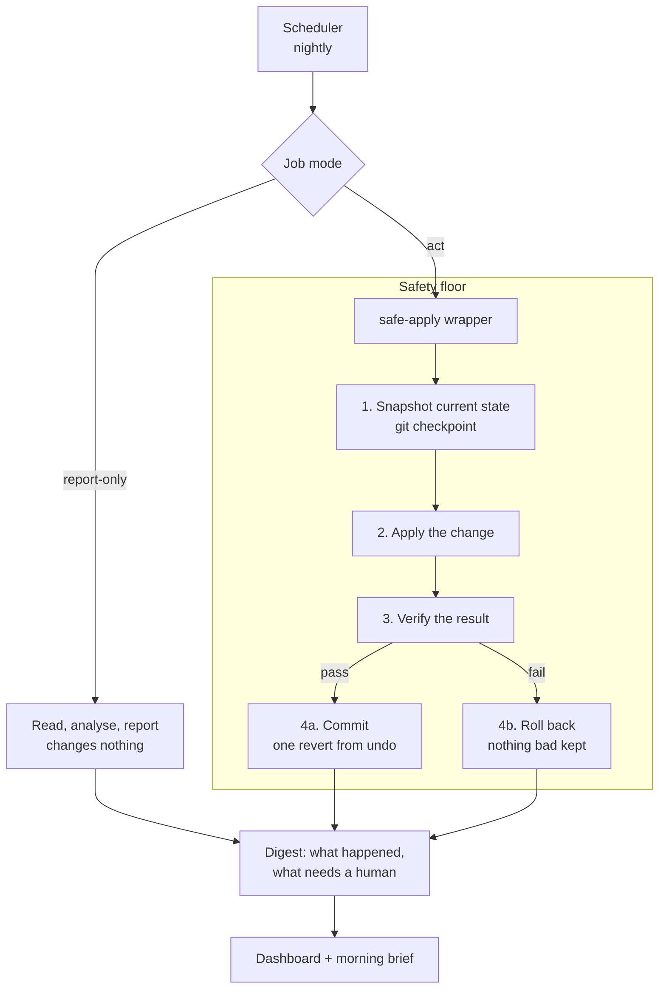
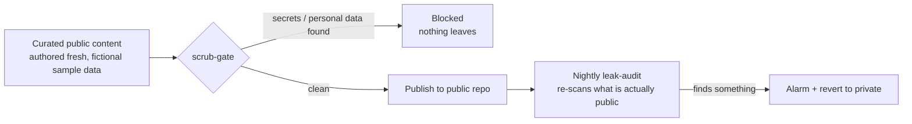

# Architecture

The system has three jobs: run useful work on a schedule, keep itself healthy,
and never do anything it cannot undo. The pieces below are deliberately small and
composable, so each can be tested and trusted on its own.

## The overnight loop

## The publish path (kept entirely separate)

Private working files never flow to a public repository automatically. The only
route out is deliberate, freshly authored content that clears a scanner.

## Why it is built this way

- **Every act-mode change goes through one safety floor.** Rather than trusting
  each job to be careful, the danger is handled once, in `safe-apply`, and every
  job inherits it. A job author cannot forget to be safe.
- **Verification, not review, is the gate.** The system does not depend on a human
  reading diffs each morning. It depends on automated checks that must pass, plus
  the fact that anything that does pass is a single commit from undo.
- **Defence in depth on anything public.** A push-time scanner stops bad content
  leaving, and a nightly audit independently re-checks what is already public, so
  a later mistake or a reclassified file is still caught.
- **Graduated autonomy.** New jobs start in report-only mode and only graduate to
  acting once they have proven safe over several cycles. Trust is earned on
  evidence, not granted up front.
